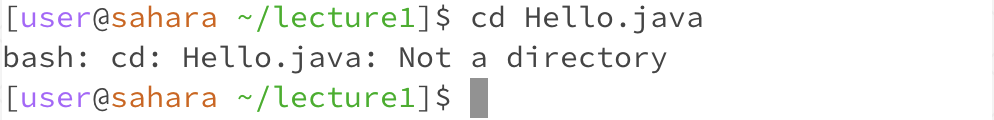
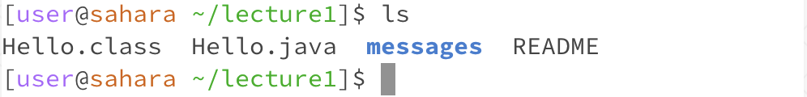
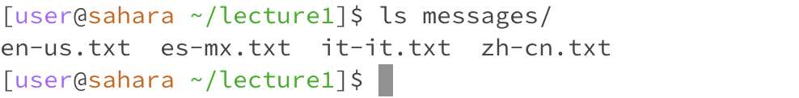
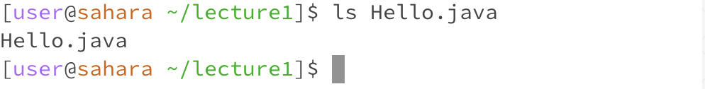
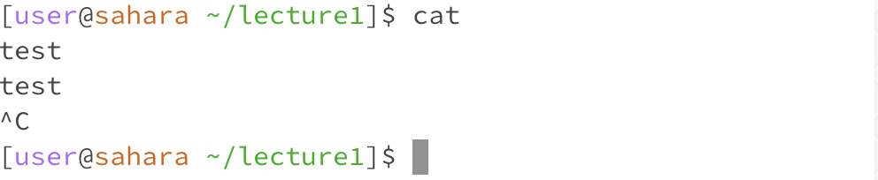
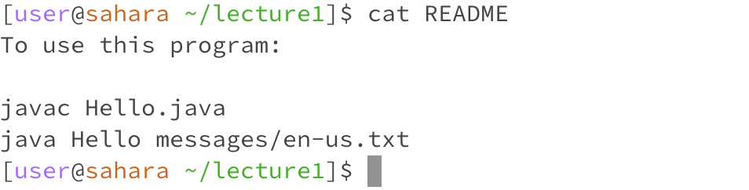

# Lab Report 1

## `cd` Command

### No Arguments
  
Working directory: `/home/lecture1`   
Explanation: Running `cd` without any arguments moves the user to the home directory.  

### Passing a Directory
  
Working directory: `/home`  
Explanation: Running `cd` with a directory moves the user to the specified directory.  

### Passing a file
  
Working directory: `/home/lecture1`  
Explanation: Running `cd` with a file causes an error because the `cd` command expects a directory to move to.  

## `ls` Command

### No Arguments
  
Working directory: `/home/lecture1`  
Explanation: Running `ls` without any arguments prints all of the files and directories  inside of the working directory.  

### Passing a Directory
  
Working directory: `/home/lecture1`  
Explanation: Running `ls` with a directory prints all of the files and directories inside of the specified directory.  

### Passing a file
  
Working directory: `/home/lecture1`  
Explanation: Running `ls` with a file simply prints the name of the file.  

## `cat` Command

### No Arguments
  
Working directory: `/home/lecture1`  
Explanation: Running `cat` without any arguments does not produce any output immediately. However, any text that is entered into the console is outputted again as many times as this is done. To quit, we use `ctrl-c`.  

### Passing a Directory
  
Working directory: `/home/lecture1`  
Explanation: Running `cat` without a directory produces an error as the functionality of `cat` is to concatenate and print out any files that are passed to it. It is unable to process just a directory name.  

### Passing a file
  
Working directory: `/home/lecture1`  
Explanation: Running `cat` with a file prints out the contents of the specified file to the console.  
