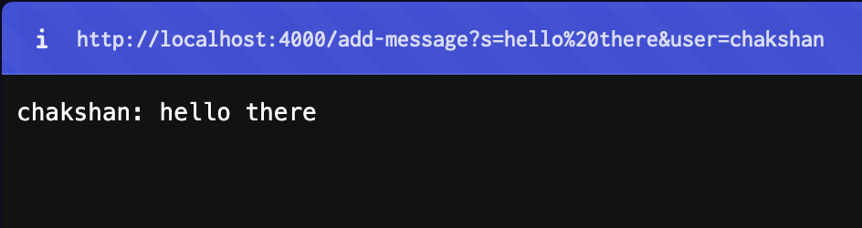
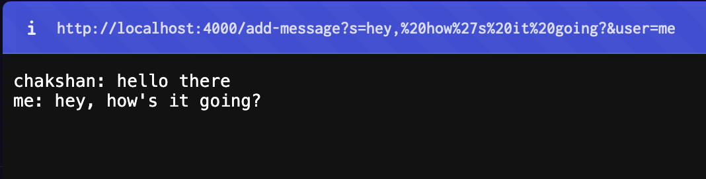
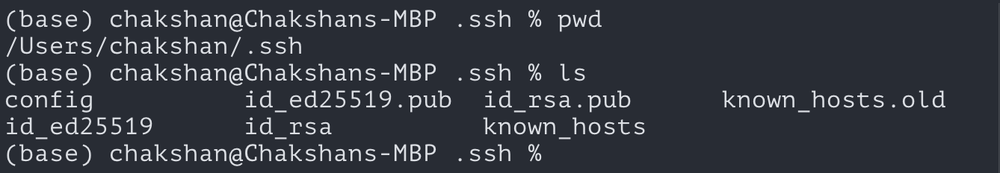

# Lab Report 3

## Part 1

### Code for the `Handler` of the `ChatServer`

The following is the handler code that is responsible for returning a `String` object to be displayed when the `ChatServer` recieves an http request.

```
class Handler implements URLHandler {

	String conversation = "";

    public String handleRequest(URI url) {
        if (url.getPath().equals("/")) {
            return conversation;
        } else if (url.getPath().equals("/add-message")) {
            String[] data = url.getQuery().split("&");
			if (data[0].startsWith("s=") &&
					data[1].startsWith("user")) {
				String message = data[0].split("=")[1];
				String user = data[1].split("=")[1];

				conversation += (String.format("%s: %s", user, message) + "\n");
				return conversation;
			} else {
				return "/add-messages requires a query parameter s and user\n";
			}	
        } else {
            return "404 Not Found!";
        }
    }
}

```

### Analyzing the Resuts of HTTP Requests

#### Request 1

##### Result
After starting the server and accessing the url `http://localhost:4000/add-message?s=hello there&user=chakshan`, this was the result displayed: 



##### Analysis
Upon receiving the http request, the `handleRequest` method of the `Handler` class is called with a `new URL("http://localhost:4000/add-message?s=hello there&user=chakshan")` object being passed in as the parameter for `url`. 

The value of `url.getPath()` is `"/add-message"`. Thus the `else if` branch of the if-else ladder is run. 

The value of `url.getQuery()` is `"s=hello there&user=chakshan"`. When `.split("&")` is called on `url.getQuery()`, it returns a `String` array with value `["s=hello there", "user=chakshan"]`. This value is then stored in the variable `data`. 

Because the first element of `data` starts with `"s="` and the second element of data starts with `"user="`, the query of the url is valid and the code inside the `if` block is run. 

The value of `data[0]` is `"s=hello there"`. When `".split("=")` is called on `data[0]`, it returns a `String` array with value `["s", "hello there"]`. The second element of this array is `"hello there"` so `"hello there"` is stored in the variable `message`. 

The value of `data[1]` is `"user=chakshan"`. When `".split("=")` is called on `data[1]`, it returns a `String` array with value `["user", "chakshan"]`. The second element of this array is `"chakshan"` so `"chakshan"` is stored in the variable `user`. 

Then the `String.format()` method is called with parameters `"%s: %s", user, message`. This method returns a `String` with value `"chakshan: hello there"`. That `String` object is concatenated with `"\n"`, a new line character, and then appended to the variable `conversation`. Its value thus becomes `"chakshan: hello there\n"`. `conversation` is then returned as the output of `handleRequest` and displayed on the webpage as shown in the image.

#### Request 2

##### Result
After the first result, the following url was accesssed `http://localhost:4000/add-message?s=hey, how's it going?&user=me`. This was the result displayed: 



##### Analysis
Upon receiving the http request, the `handleRequest` method of the `Handler` class is called with a `new URL("http://localhost:4000/add-message?s=hey, how's it going?&user=me")` object being passed in as the parameter for `url`. 

The value of `url.getPath()` is `"/add-message"`. Thus the `else if` branch of the if-else ladder is run. 

The value of `url.getQuery()` is `"s=hey, how's it going?&user=me"`. When `.split("&")` is called on `url.getQuery()`, it returns a `String` array with value `["s=hey, how's it going?", "user=me"]`. This value is then stored in the variable `data`. 

Because the first element of `data` starts with `"s="` and the second element of data starts with `"user="`, the query of the url is valid and the code inside the `if` block is run. 

The value of `data[0]` is `"s=hey, how's it going?"`. When `".split("=")` is called on `data[0]`, it returns a `String` array with value `["s", "hey, how's it going?"]`. The second element of this array is `"hey, how's it going?"` so `"hey, how's it going?"` is stored in the variable `message`. 

The value of `data[1]` is `"user=me"`. When `".split("=")` is called on `data[1]`, it returns a `String` array with value `["user", "me"]`. The second element of this array is `"me"` so `"me"` is stored in the variable `user`. 

Then the `String.format()` method is called with parameters `"%s: %s", user, message`. This method returns a `String` with value `"me: hey, how's it going?"`. That `String` object is concatenated with `"\n"`, a new line character, and then appended to the variable `conversation`. Its value thus becomes `"chakshan: hello there\nme: hey, how's it going?\n"`. `conversation` is then returned as the output of `handleRequest` and displayed on the webpage as shown in the image.


## Part 2
Absolute path of private key: `/Users/chakshan/.ssh/id_rsa`



Absolute path of public key: `.../.ssh/id_rsa.pub`


Remote login without password:


## Part 3
Prior the labs from week 2 and week 3, I did not know or understand much about the way URLs are structured and the way they worked. Now I understand most of the various components of a URL including its domain, port number, path, and query. While using them hands on through Github pages, the path structure made perfect sense. When using URLs in our custom server classes, I saw how port numbers were used and began to understand that queries could be used to customize the output of a webpage to the user's needs.
