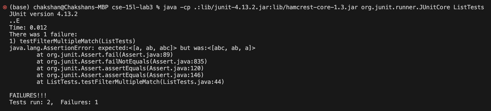

# Week 5 - Lab Report

## Part 1 - Bugs

### The Buggy Code in Question
```
static List<String> filter(List<String> list, StringChecker sc) {
    List<String> result = new ArrayList<>();
    for(String s: list) {
      if(sc.checkString(s)) {
        result.add(0, s);
      }
    }
    return result;
}
```

### Failure Inducing Input
```
public class StringContains implements StringChecker {
	@Override
	public boolean checkString(String s) {
		return s.contains("a");
	}
}
	
@Test
public void testFilterMultipleMatch() {
	ArrayList<String> input = new ArrayList<>();
	input.add("a");
	input.add("ab");
	input.add("abc");
	input.add("bcd");

	ArrayList<String> expected = new ArrayList<>();
	expected.add("a");
	expected.add("ab");
	expected.add("abc");

	StringContains contains = new StringContains();
	List<String> output = ListExamples.filter(input, contains);
	assertEquals(expected, output);
}
```

### Success Inducing Input
```
public class StringContains implements StringChecker {
	@Override
	public boolean checkString(String s) {
		return s.contains("a");
	}
}

@Test
public void testFilterSingleMatch() {
	ArrayList<String> input = new ArrayList<>();
	input.add("x");
	input.add("y");
	input.add("z");
	input.add("abc");

	ArrayList<String> expected = new ArrayList<>();
	expected.add("abc");
}
```

### Symptom



### The Bug

Code Before
```
static List<String> filter(List<String> list, StringChecker sc) {
    List<String> result = new ArrayList<>();
    for(String s: list) {
      if(sc.checkString(s)) {
        result.add(0, s);
      }
    }
    return result;
}
```

Code After
```
static List<String> filter(List<String> list, StringChecker sc) {
    List<String> result = new ArrayList<>();
    for(String s: list) {
      if(sc.checkString(s)) {
        result.add(s);
      }
    }
    return result;
}
```

The code before added each string that matched to index 0 of the `results` list. This causes the filtered strings to appear in reverse order. The desired before for this code is to filter the strings and also present them in the same order that they appeared in the original list. Thus, in the after code, the matches are added to the end of the `results` list to preserve their order.

# Part 2 - Research Commands

## Command Selected: `grep`

### Option 1: `-i`

#### Example 1:

Working directory: `./technical/biomed`

```
$ grep -i "tEsT" 1468-6708-3-1.txt
          plotted mean adjusted YOL and YHL against BMI, and tested
        t-tests for the differences in means of the two groups
          32 ] , the greatest advances may be made by improving
```
This command is searching for all lines with the string `"tEsT"` in the file `1468-6708-3-1.txt` regardless of capitalization. 

#### Example 2: 

Working directory: `.technical/plos`

```
$ grep -i "PaIr" journal.pbio.0020232.txt
        Msx1 -deficient mice exhibit impaired fetal digit-tip regeneration, a
```
This command is searching for all lines with the string `"PaIr"` in the file `1468-6708-3-1.txt` regardless of capitalization. 

#### Usefulness
The `-i` option is useful when you wish to find strings within a file without case sensitivity.

### Option 2: `-c`

#### Example 1
Working directory: `./technical/biomed`

```
$ grep -c "the" 1471-2202-1-1.txt
154
```
This command outputs the number of lines which contain the string `"the"` in the file `"1471-2202-1-1.txt"`. 

#### Example 2
Working directory: `./technical/plos`
```
$ grep -c "duplication" journal.pbio.0020206.txt
39
```
This command outputs the number lines which contain the string `"duplication"` in the file `"journal.pbio.0020206.txt"`.

#### Usefulness
The `-c` option is useful when you wish not to see the lines that contain a match but rather just see their count.

### Option 3: `-l`

#### Example 1
Working directory: `./technical/biomed`
```
$ grep -l "test tube" *
1471-2458-3-5.txt
1476-511X-2-2.txt
cc300.txt
```
This command outputs the names of the all of the files in the current working directory that contain the string `"test tube"` in their contents.

#### Example 2
Working directory: `./technical/plos`
```
$ grep -l "fuse" journal.*
journal.pbio.0020043.txt
journal.pbio.0020064.txt
journal.pbio.0020067.txt
journal.pbio.0020125.txt
journal.pbio.0020172.txt
journal.pbio.0020183.txt
journal.pbio.0020215.txt
journal.pbio.0020262.txt
journal.pbio.0020354.txt
journal.pbio.0020401.txt
journal.pbio.0020430.txt
journal.pbio.0030131.txt
```
This command outputs the names of the all of the files starting with `"journal."` in the current working directory that contain the string `"fuse"` in their contents.

#### Usefulness
The `-l` opion is useful when you wish to simply see just which files contain a match.

### Option 4: `-w`

#### Example 1
```
$ grep -w "ring" 1471-2164-3-18.txt
          protein usually oligomerize into ring-shaped hexameric
          shape of the overall hexameric ring in a manner that
          substrates. In most AAA proteins, the ring structure is
          believed to form a unimolecular pseudo-hexameric AAA ring
          shape of the overall hexameric ring [ 19 ] .
          protrude asymmetrically from the hexameric AAA ring.
          hexameric ring [ 14 ] . We cannot, at present, exclude an
          hexameric AAA ring assembly is a dimeric two-layered
        insertion of Mg 2+into the protoporphyrin IX ring in the
        protoporphyrin ring in either the presence or absence of
        to form an oligomeric ring of AAA protomers that resembles
        the ring structure of NSF and other AAA proteins [ 14 32 ]
        of the chelated Mg 2+to the protoporphyrin ring by BchH [
        AAA ring, this chelation reaction provides a structural
        in the pseudo-hexameric ring and thus couple ATP hydrolysis
```
This command outputs all of the lines containing the word `"ring"` in the file `"1471-2164-3-18.txt"`.

#### Example 2

Working directory: `./technical/biomed`

```
$ grep -w "test" 1468-6708-3-1.txt
```
This command outputs all of the lines containing the word `"test"` in the file `"1468-6708-3-1.txt"`. In this case there are no matches unlike when the command `grep "test" 1468-6708-3-1.txt` is run.

#### Usefulness
The `-w` option is useful when you wish to find lines that contain a certain word as an individual part and not subpart of another word.


## Sources Used
https://www.geeksforgeeks.org/grep-command-in-unixlinux/ 

man grep (linux manual page for grep)