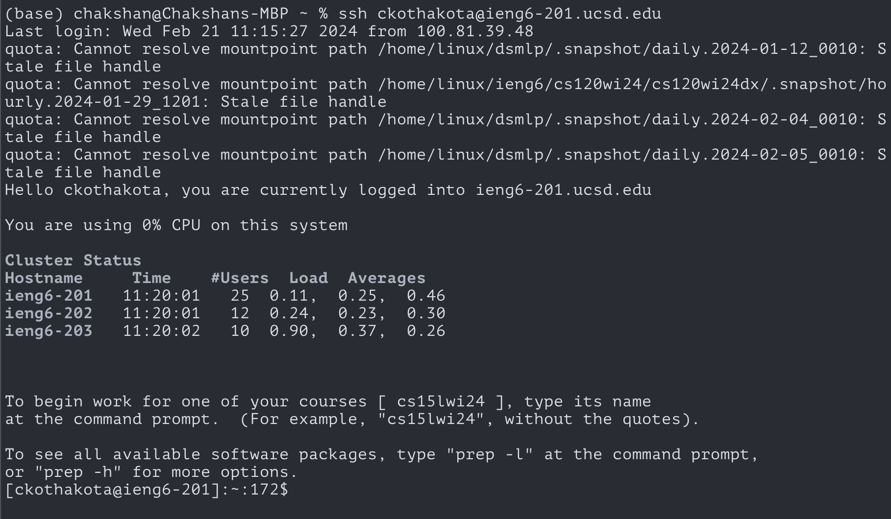
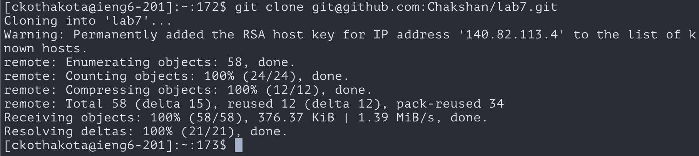
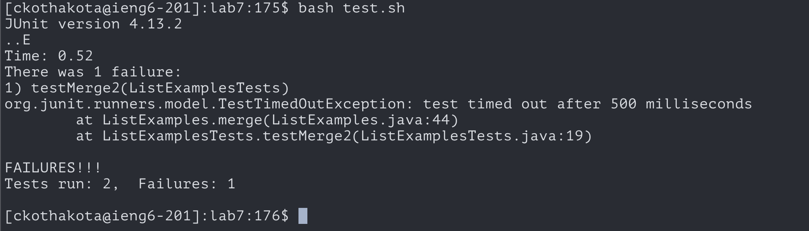
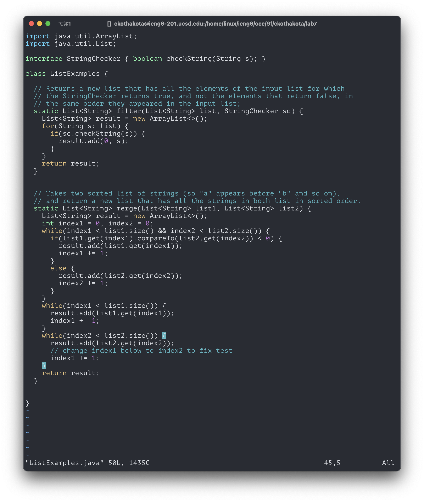
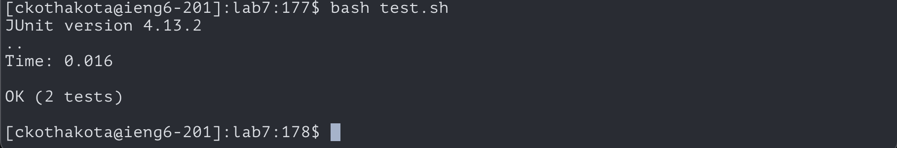
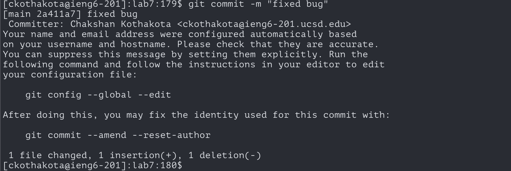
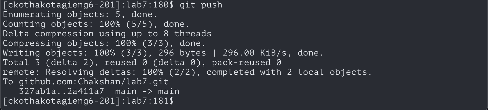

# Week 7 - Lab Report

## Step 4 - Log into ieng6

**Keys pressed:** `<ctrl-r>s<enter>`    
**Command run:** `ssh ckothakota@ieng6-201.ucsd.edu`   
**Description:** I accessed my command history using `ctrl-r`. I searched for any commands I entered with the letter `s` and ran the `ssh` command that showed up. 

## Step 5 - Clone
  
**Keys pressed:** `<ctrl-r>g<enter>`   
**Command run:** `git clone git@github.com:Chakshan/lab7.git`   
**Description:** I accessed my command history using `ctrl-r`. I searched for any commands I entered with the letter `g` and the `git clone` command was the first that showed up. 

## Step 6 - Run tests

**Keys pressed:** `cdl<tab><enter><ctrl-r>ba<enter>`   
**Commands run:**
```
cd lab7
bash test.sh
``` 
**Description:** I typed the `cd` because it was relatively short. Then I typed `l` for the `lab7` directory and pressed `<tab>` to autocomplete. After entering this command, I entered the `lab7` directory. From there, I accessed my command history with `<ctrl-r>` and entered `ba` to search for the `bash` command to run the script. When I found it, I ran the command. 

## Step 7 - Fix bug


**Keys pressed:** `vimL<tab>.<tab><enter>43jer2:wq`   
**Command run:** `vim ListExamples.java` (followed by vim commands `43jer2:wq`)   
**Description:** I type the `vim` command and an `L` for `ListExamples.java`. I then used `tab` to auto complete to `ListExamples`. Then I typed `.` to narrow the autocomplete's file guess and pressed `tab` again to fully complete the file name and ran the command to enter into `vim`. Inside `vim`, I typed `43j` to move my cursor to the 43rd line. I pressed `e` to move to the end of the variable `index1`. I then typed `r2` to replace the `1` with a `2`. I then entered `:wq` to write and quit the file.  

## Step 8 - Rerun Tests

**Keys pressed:** `<up><up><enter>`   
**Command run:** `bash test.sh`    
**Description:** The `bash` command was 2 up in my command history so I used the up arrow to access and run it.  

## Step 9 - Commit and push



**Keys pressed:** `<ctrl-r>a<ent$r><ctrl-r>co<enter><ctrl-r>pu<enter>`   
**Commands run:**
```
git add ListExamples.java
git commit -m "fixed bug"
git push
``` 
**Description:** I accessed my command history using `ctrl-r`. I searched for `a` to find the `git add` command I ran previously and entered it. I did another command history search with the letters `co` to find the `git commit` command I ran previously and entered it. Lastly, I did one more command history search with the letters `pu` to find the `git push` command I ran previously and entered it. 