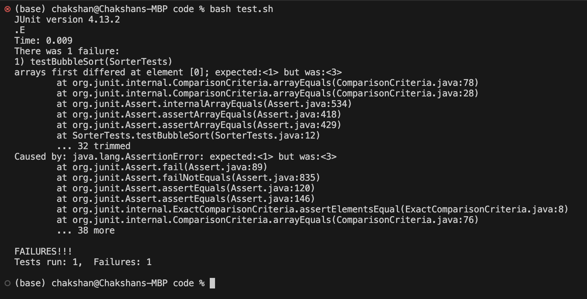
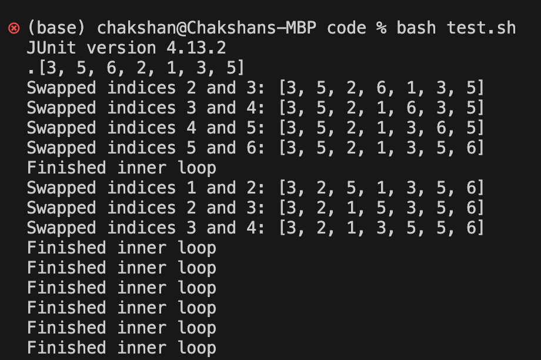

# Week 9 - Lab Report

## Part 1

### Orignal Post
Subject: Bubble Sort Bug

Hello everyone, I wrote some code for a bubble sort algorithm and some tester code to verify that it works properly. However, when I run my test, I get an error stating that my algorithm did not sort my list correctly. I am not exactly sure why this is and was hoping for any advice.

Here some details about code I wrote:

File structure:
```
code/
    Sorter.java
    SorterTests.java
    test.sh
lib/
    hamcrest-core-1.3.jar
    junit-4.13.2.jar
```

Bubble Sort Algorithm:
```
public static void bubbleSort(int[] arr) {
    for (int i = 0; i < arr.length; i++) {
        for (int j = i; j < arr.length-1; j++) {
            if (arr[j] > arr[j+1]) {
                swap(arr, j, j+1);
            }
        }
    }
}
    
public static void swap(int[] arr, int i, int j) {
    int temp = arr[i];
    arr[i] = arr[j];
    arr[j] = temp;
}
```

JUnit Test:
```
@Test
public void testBubbleSort() {
    int[] input = {3, 5, 6, 2, 1, 3, 5};
    int[] expect = {1, 2, 3, 3, 5, 5, 6};
    Sorter.bubbleSort(input);
    assertArrayEquals(expect, input);
}
```

Bash Test Script:
```
CPATH=".:../lib/hamcrest-core-1.3.jar:../lib/junit-4.13.2.jar"
javac -cp $CPATH *.java
java -cp $CPATH org.junit.runner.JUnitCore SorterTests
```

Here is the symptom I am facing:


I suspect that my algorithm may not be swapping the right values. Any guidance on how to debug this issue would be extremely appreciated.

### TA Response
Consider what should happen after each iteration of your outer loop and how that would impact what your inner loop bounds should be. It is a bit difficult to gain any insights on your sorting algorithm with just the JUnit test error output. I would recommend adding some print statements within in your code to see how the inputted array is sorted after each loop iteration. Consider using jdb alternatively.

### Student Response:
Thank you so much for your advice! I added some print statements and realized what was wrong with my algorithm. Here is the output of my prints:

From your response and after investing the bubble sort algorithm, I realized that each iteration of the outer loop moves the largest element to the end of the list and does not immediately fix the order of smaller elements which are only sorted through subsequent iterations. I thus found that the bug in my algorithm was with the inner loop bounds:

Code Before:
```
public static void bubbleSort(int[] arr) {
    for (int i = 0; i < arr.length; i++) {
        for (int j = i; j < arr.length-1; j++) {
            if (arr[j] > arr[j+1]) {
                swap(arr, j, j+1);
            }
        }
    }
}
```

Code After:
```
public static void bubbleSort(int[] arr) {
    for (int i = 0; i < arr.length; i++) {
        for (int j = 0; j < arr.length-i-1; j++) {
            if (arr[j] > arr[j+1]) {
                swap(arr, j, j+1);
            }
        }
    }
}
```
## Part 2
I found my lab experience this quarter to be really valuable. In particular, the process of learning how to build the grading script for something similar to gradescrope extemely rewarding. I had little experience with bash before. However, in writing this script, I got more familiar with it and found it to be a valuable tool in my arsenal. Shell commands like grep, find, and awk were extremely cool as well and I can see myself using them a lot in the future. I also thought it was extremely cool to learn how to use these command line tools. It made me feel like I was in control everything that I do and not yielding any control to an IDE.
Thank you all for giving me this experience!
